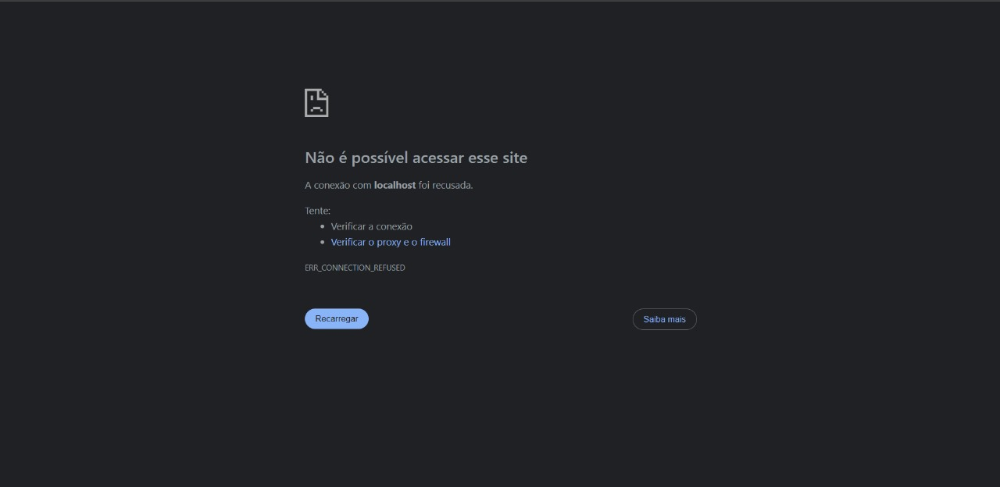

# 🐧 Atividade Linux

Este repositório contém o projeto desenvolvido para a atividade de Linux do programa de bolsas da Compass UOL.

A proposta é criar um script em Bash para monitorar se um site está online ou fora do ar. O resultado é salvo em um log local e também é enviada uma notificação para um canal no Discord via webhook.

---

## 🚀 Como usar

1. **Clone este repositório**
   ```bash
   git clone https://github.com/seu-usuario/projetoLinuxPb.git
   cd projetoLinuxPb
   ```

2. **Torne o script executável**
   ```bash
   chmod +x meu_script.sh
   ```

3. **Execute o script**
   ```bash
   ./meu_script.sh
   ```

---

## 📌 Requisitos

- Distribuição Linux
- `curl` instalado
- Webhook do Discord configurado (modifique no código)

---

## 💡 Exemplo de uso

Suponha que você tenha um servidor local rodando na porta 80 (`http://localhost`). Ao executar o script, ele irá verificar se está online. Se o site estiver fora do ar (retorno diferente de 200), ele registra isso em um arquivo `.log` e envia uma mensagem no seu canal do Discord avisando sobre o problema.

---

## 📄 Código com explicações

```bash
#!/bin/bash

# Caminho padrão (opcional, pode ser descomentado se necessário)
# PATH=/usr/local/sbin:/usr/local/bin:/usr/sbin:/usr/bin:/sbin:/bin

# URL a ser monitorada
URL="http://localhost"

# Caminho para o arquivo de log
LOG_FILE="/mnt/d/projetoLinuxPb/meu_script.log"

# Webhook do Discord (substitua pelo seu)
DISCORD_WEBHOOK="https://discord.com/api/webhooks/..."

# Gera um timestamp no formato "YYYY-MM-DD HH:MM:SS"
TIMESTAMP=$(date '+%Y-%m-%d %H:%M:%S')

# Função para enviar alerta no Discord
send_discord_alert() {
  MESSAGE="$1"
  curl -H "Content-Type: application/json" \
       -X POST \
       -d "{\"content\": \"$MESSAGE\"}" \
       "$DISCORD_WEBHOOK"
}

# Início da verificação
echo "$TIMESTAMP - Verificando o site..." >> $LOG_FILE

# Faz uma requisição para a URL e guarda o código de status
STATUS_CODE=$(curl -s -o /dev/null -w "%{http_code}" $URL)

# Verifica se o status é diferente de 200 (site fora do ar)
if [ "$STATUS_CODE" -ne 200 ]; then
  LOG_MSG="$TIMESTAMP - Site fora do ar (status: $STATUS_CODE)"
  echo "$LOG_MSG" >> $LOG_FILE
  send_discord_alert ":warning: $LOG_MSG"
else
  LOG_MSG="$TIMESTAMP - Site online (status: $STATUS_CODE)"
  echo "$LOG_MSG" >> $LOG_FILE
  send_discord_alert ":white_check_mark: $LOG_MSG"
fi
```
---

## 👾 Criação do Webhook no Discord

Para monitorar se o servidor está fora do ar, criei um Webhook usando o Discord. Primeiro, abri o Discord e, no menu à esquerda, cliquei no botão de "+" para criar um novo servidor. Escolhi a opção "Criar o meu" e depois selecionei "Para meus amigos e eu". Depois disso, dei um nome ao servidor e cliquei em "Criar" para finalizar a configuração inicial.

## Primeiro Crie Um Servidor no Discord 


## Segundo Vá na Engrenagem do Geral


## Terceiro Clique em Integrações 


## Quarto Clique em Criar Webhook 


## Quinto Clique no Boot que Foi Criado


## Por Último Clique em Copiar URL do Webhook


---

## 🧠 O que você aprende com esse projeto?

- Como escrever scripts em Bash
- Como usar `curl` para requisições HTTP
- Como trabalhar com arquivos de log no Linux
- Como integrar notificações com o Discord via Webhook
- Como automatizar tarefas de monitoramento

---

## ✅ Verificações do Site

Executar o comando ```bash sudo systemctl start nginx``` inicia o servidor Nginx, o que faz com que o site fique acessível no navegador com seu IP ou localhost.

## Visualização do Site em Execução


Executar o comando ```bassudo systemctl stop nginx``` interrompe o servidor Nginx, fazendo com que o site deixe de estar disponível no navegador.

## Visualização do Boot do Discord Indicando a Mensagem de Site Online


## Visualização do Site Fora do Ar



## Visualização do Boot do Discord Indicando a Mensagem de Site Fora do Ar


## 🌐 Site Monitorado

O site monitorado pelo script é uma página HTML simples e moderna, criada por mim, com layout responsivo, animações e design agradável. Ele simula uma página profissional hospedada em um ambiente Linux, e serve como alvo para o monitoramento automatizado.

### 🔎 Principais características do site:

- Cabeçalho fixo com navegação (Início, Sobre, Contato)
- Seção de boas-vindas com mensagens e botão de ação
- Fundo com imagem de alta resolução
- Design responsivo e animações CSS (`fadeInUp`, `fadeInDown`)
- Estilizado com CSS puro (sem frameworks externos)

---

## 🌐 Configuração do Servidor com Nginx

O trecho de código abaixo configura o **Nginx** para servir arquivos de um diretório específico no seu sistema. Essa configuração é útil para hospedar a página HTML que será monitorada pelo script Bash.

### 📄 Código de Configuração Nginx

```nginx
server {
    listen 0.0.0.0:80;
    server_name SEU IP PÚBLICO localhost;

    root /mnt/d/projetoLinuxPb;
    index index.html;

    location / {
        try_files $uri $uri/ =404;
    }
}
```

---

### 🛠️ Explicação do Código
1. **`listen 0.0.0.0:80;`**
   - Configura o servidor para escutar conexões na porta 80 (HTTP) em todas as interfaces de rede disponíveis.

2. **`server_name 172.28.168.201 localhost;`**
   - Define os nomes de domínio ou endereços IP que este servidor irá responder. Neste caso, o servidor responde tanto ao IP `172.28.168.201` quanto ao `localhost`.

3. **`root /mnt/d/projetoLinuxPb;`**
   - Especifica o diretório onde estão os arquivos que serão servidos. Aqui, a raiz do servidor é definida como `/mnt/d/projetoLinuxPb`.

4. **`index index.html;`**
   - Define o arquivo padrão a ser exibido quando o usuário acessa a raiz do servidor (`/`). Neste caso, o arquivo `index.html`.

5. **Bloco `location /`**
   - Configura o comportamento para requisições feitas ao caminho `/`.
   - **`try_files $uri $uri/ =404;`**:
     - Verifica se o arquivo ou diretório solicitado existe:
       - `$uri`: Procura o arquivo correspondente ao caminho requisitado.
       - `$uri/`: Procura um diretório correspondente ao caminho requisitado.
       - `=404`: Retorna um erro 404 caso o arquivo ou diretório não sejam encontrados.

---

### 💡 Como Usar

1. **Copie o código acima** e salve-o em um arquivo de configuração do Nginx, por exemplo:
   ```bash
   sudo nano /etc/nginx/sites-available/projetoLinuxPb
   ```

2. **Crie um link simbólico** para habilitar o site:
   ```bash
   sudo ln -s /etc/nginx/sites-available/projetoLinuxPb /etc/nginx/sites-enabled/
   ```

3. **Teste a configuração do Nginx** para garantir que não há erros:
   ```bash
   sudo nginx -t
   ```

4. **Reinicie o Nginx** para aplicar as alterações:
   ```bash
   sudo systemctl restart nginx
   ```

---

### 🖥️ Resultado Esperado

Quando configurado corretamente, ao acessar o IP ou o domínio configurado no navegador (ex.: `http://172.28.168.201` ou `http://localhost`), o Nginx servirá o arquivo `index.html` localizado no diretório `/mnt/d/projetoLinuxPb`.

---

## 🖥️ Código-fonte (resumo do HTML)

```html
<!DOCTYPE html>
<html lang="pt-BR">
<head>
  <meta charset="UTF-8">
  <title>Minha Página Profissional</title>
  <style>
    body {
      background: url('https://images.unsplash.com/photo...') no-repeat center center;
      background-size: cover;
      font-family: 'Poppins', sans-serif;
      color: white;
    }
    header {
      background: rgba(0, 0, 0, 0.6);
      position: fixed;
    }
    .hero {
      display: flex;
      flex-direction: column;
      justify-content: center;
      align-items: center;
      animation: fadeInUp 1.5s ease forwards;
    }
    /* ... demais estilos ... */
  </style>
</head>
<body>
  <header>
    <h1>MeuSite</h1>
    <nav>
      <a href="#">Início</a>
      <a href="#">Sobre</a>
      <a href="#">Contato</a>
    </nav>
  </header>
  <section class="hero">
    <h2>Seja Bem-vindo!</h2>
    <p>Esta é uma página moderna hospedada em Linux...</p>
    <a href="#" class="button">Saiba Mais</a>
  </section>
</body>
</html>
```

---

## 📄 Licença

Este projeto está licenciado sob a licença MIT. Consulte o arquivo `LICENSE` para mais detalhes.
